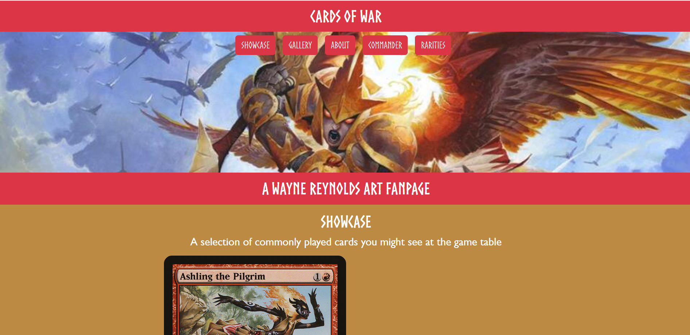

# Cards of WAR :flower_playing_cards:

https://jacobgriffith1.github.io/Cards_of_WAR/

Cards of WAR is a celebration of the art of Wayne Reynolds featured on Magic: The Gathering cards.

This webpage features a gallery of every card printing featuring his art up to MTG: Foundations Jumpstart (2025), as well as some fun sections higlighting different cards.

This project was an exercise in using Bootstrap, and features very little CSS.

Please enjoy this showcase of fine fantasy art!

# Features
## Showcase :black_joker:

Showcase features a few different cards commonly played, especially in the Commander format. The items are on a carousel, and rotate after giving ample time to observe the card. The set and year of first printing are included in addition to the card image.

## Gallery :camera:

Gallery features every printing of every card containing the art of Wayne Reynolds up to Foundations Jumpstart. Hovering over a card will enlarge it for ease of viewing.

It has two options for viewing the cards:
- By Set: Displays cards in the order they were printed, sorted by the card sets they were contained in. Presented as an accordion for selective viewing.
- All: Displays all cards.

Due to the large size of this section, buttons to move to the top or bottom of the gallery are included at both ends.

## About :book:

About provides an explanation for some key details about the site, as well as an aside displaying the signature of Wayne Reynolds.

## Commander :crown:

Commander displays cards eligible to be used as a commander in the Commander format of Magic: The Gathering. A dropdown allows for the sorting of cards by color, and double-sided cards (indicated by gold borders) can be flipped by clicking them.

## Rarities :sparkles:

This section shows off some of the hardest to acquire cards illustrated by Wayne Reynolds. These are not sorted in any particular order, and rotate on a carousel.

### Updates

Cards of WAR is planned to be massively reworked to run and look better. Please look forward to future updates!

New/Revised features to be implemented:
- Backend for handling image requests
- "Card of the Day" feature with Scryfall api integration
- Commander section linking to external resources for building decks

### About the Author
My name is Jacob Griffith, and I'm ready to help you build your next website! Whether you're looking for a professional design for a law practice, something inviting for a restaurant, a fun landing page for a tourist attraction, or anything in between, I'm your guy for the job. I am very adaptable, so I can provide whatever web design services you require to reach your goals! Feel free to send me an email at jacobgriffith6339@gmail.com to get in touch. I'll get back to you in 2-3 days, or sooner when possible.

- GitHub: <https://github.com/JacobGriffith1>
- LinkedIn: <https://www.linkedin.com/in/jacobgriffith1>
- Personal Site: <https://jacobgriffith1.github.io/griffith_web_design>
